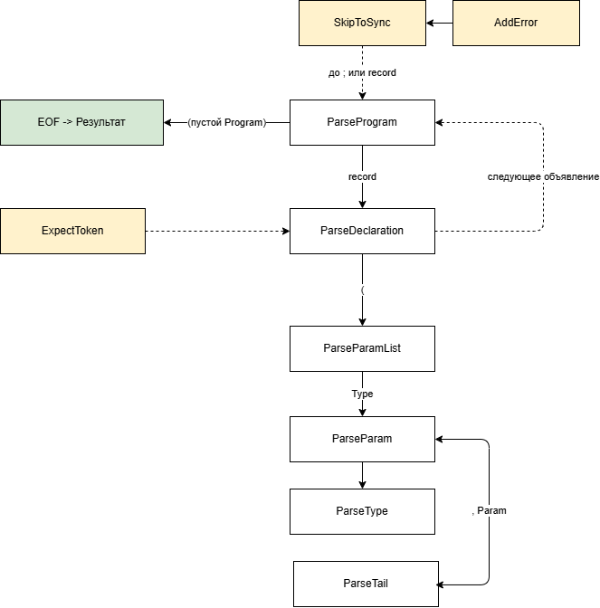
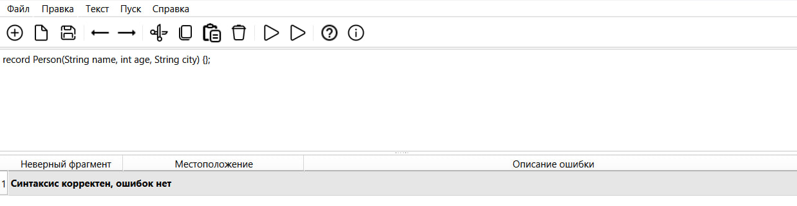
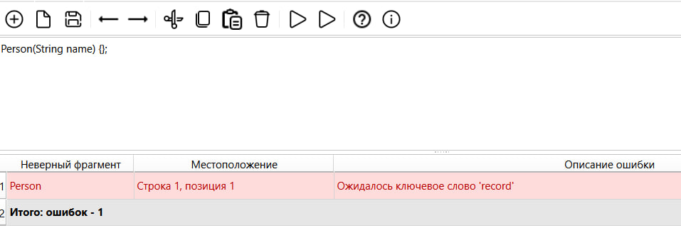
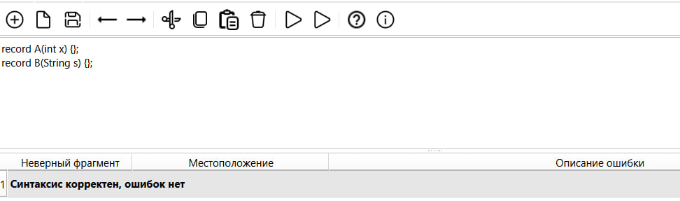
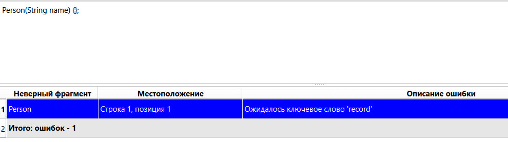
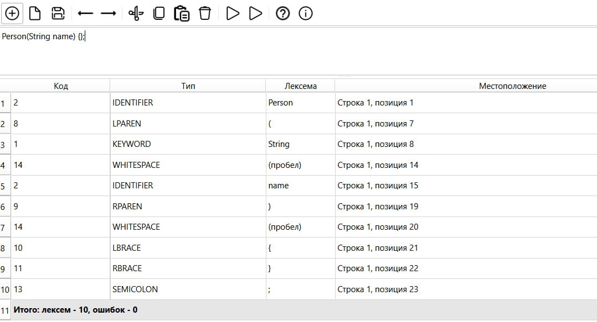

# Лабораторная работа №3 - Разработка синтаксического анализатора (парсера)

## Цель работы
Изучить назначение и принципы работы синтаксического анализатора в структуре компилятора. Спроектировать грамматику, построить соответствующую схему метода анализа грамматики и выполнить программную реализацию парсера с нейтрализацией синтаксических ошибок методом Айронса. Интегрировать разработанный модуль в ранее созданный графический интерфейс языкового процессора.

## Автор
+ Башинов Арья Игоревич
+ Группа: АП-326

## Постановка задачи
Разработать синтаксический анализатор (парсер) в соответствии с индивидуальным вариантом курсовой работы, интегрировать его в приложение из лабораторной работы №1 и обеспечить наглядный вывод результатов анализа.

### Требования к разработке парсера
- Разработать грамматику для заданной синтаксической конструкции.
- Построить схему метода анализа на основе разработанной грамматики.
- Выполнить программную реализацию алгоритма работы синтаксического анализа.
- Реализовать алгоритм нейтрализации синтаксических ошибок методом Айронса.

### Входные данные
Строка или многострочный текст программного кода из области редактирования.

### Выходные данные
При успешном анализе корректной строки - сообщение об отсутствии ошибок.
При обнаружении ошибок - таблица с описанием каждой ошибки.

## Вариант задания

**Номер варианта: 17.** Объявление структуры на языке Java.

Пример корректной конструкции:
```java
record Person(String name, int age, String city) {};
```

Допустимые лексемы:

| Лексема | Код |
| --- | --- |
| Ключевое слово `record` | 1 |
| Ключевые слова типов (`String`, `int`, `long`, `double`, `float`, `boolean`, `char`, `byte`, `short`) | 1 |
| Идентификатор | 2 |
| `(` | 8 |
| `)` | 9 |
| `{` | 10 |
| `}` | 11 |
| `,` | 12 |
| `;` | 13 |

### Примеры корректных строк
```java
record Person(String name, int age, String city) {};
record Empty() {};
record A(int x) {};
record B(String s) {};
record C(double d) {};
```

## Разработка грамматики

Формально грамматика записывается в виде:

G[Z] = (Vn, Vt, P, Z)

Vn = { Z, Program, Declaration, ParamList, Tail, Param, Type }

Vt = { record, id, String, int, long, double, float, boolean, char, byte, short, (, ), {, }, ,, ; }

P:

1. Z           -> Program
2. Program     -> Declaration Program
3. Program     -> ε
4. Declaration -> record id ( ParamList ) { } ;
5. ParamList   -> Param Tail
6. ParamList   -> ε
7. Tail        -> , Param Tail
8. Tail        -> ε
9. Param       -> Type id
10. Type       -> String
11. Type       -> int
12. Type       -> long
13. Type       -> double
14. Type       -> float
15. Type       -> boolean
16. Type       -> char
17. Type       -> byte
18. Type       -> short

### Расшифровка обозначений
```
id      -> буква {буква | цифра | _}
буква   -> 'a'..'z' | 'A'..'Z' | '_'
цифра   -> '0'..'9'
ε       -> пустая цепочка
```

## Классификация грамматики (по Хомскому)

Разработанная грамматика является контекстно-свободной, то есть относится к грамматикам 2 типа по классификации Хомского.

Это объясняется тем, что каждое правило вывода имеет вид:

```
A -> α
```

где:
- A - один нетерминальный символ;
- α - последовательность терминальных и нетерминальных символов.

Так как в левой части каждого правила стоит ровно один нетерминал, разработанная грамматика является контекстно-свободной и допускает построение синтаксического анализатора методом рекурсивного спуска.

## Метод анализа

Так как разработанная грамматика является контекстно-свободной, для синтаксического анализа используется метод рекурсивного спуска.

Основная идея метода рекурсивного спуска состоит в том, что каждому нетерминалу грамматики ставится в соответствие отдельная процедура синтаксического анализа. Эти процедуры вызываются в соответствии с правилами грамматики и последовательно распознают корректную цепочку лексем.

В программе реализованы следующие основные процедуры:
- ParseProgram
- ParseDeclaration
- ParseParamList
- ParseParam
- ParseType
- ParseTail
- SkipToSync
- ExpectToken
- AddError

Главной процедурой является ParseProgram, которая соответствует начальному символу Z и анализирует последовательность объявлений вида:

```
record идентификатор ( список_параметров ) { } ;
```

## Схема метода рекурсивного спуска



## Диагностика и нейтрализация синтаксических ошибок

Для диагностики и нейтрализации синтаксических ошибок в программе реализован механизм восстановления разбора, основанный на идее метода Айронса.

Основная идея состоит в том, что при возникновении синтаксической ошибки анализатор не прекращает работу полностью, а:
- фиксирует ошибочный фрагмент;
- выполняет восстановление по ближайшим точкам синхронизации;
- продолжает разбор оставшегося текста.

В данной работе это реализовано следующим образом:
- При обнаружении ошибки вызывается метод AddError, который сохраняет ошибочный фрагмент, позицию ошибки и сообщение об ошибке.
- Метод SkipToSync считывает некорректную последовательность токенов до ближайшей точки синхронизации.
- Метод ExpectToken выполняет проверку ожидаемых символов.

В качестве точек синхронизации используются ключевые элементы конструкции:
- `;` - признак конца объявления;
- `record` - начало следующего объявления.

Такой подход позволяет:
- не останавливаться после первой ошибки;
- находить несколько ошибок за один запуск;
- не генерировать каскад ложных ошибок после одной реальной;
- сохранять устойчивость анализа даже при многострочном вводе.

## Интерфейс программы

Функциональность интерфейса:
- ввод текста в область редактирования;
- запуск лексического анализа по F5 или через меню «Пуск -> Лексический анализ»;
- запуск синтаксического анализа по F6 или через меню «Пуск -> Синтаксический анализ»;
- вывод найденных ошибок в таблицу из трёх колонок: неверный фрагмент, местоположение, описание ошибки;
- отображение общего количества ошибок в итоговой строке и в строке состояния;
- переход к месту ошибки по щелчку на строке таблицы;
- подсветка ошибочных строк красным цветом.

## Тестовые примеры

### Пример корректного ввода

Входная строка:
```java
record Person(String name, int age, String city) {};
```

Результат работы программы:



### Пример некорректного ввода

Входная строка:
```java
record Person(name, int age) {};
```

В первом параметре пропущен тип. Результат работы программы:



### Пример многострочного ввода

Входная строка:
```java
record A(int x) {};
record B(String s) {};
record C(double d) {};
```

Результат работы программы:



### Навигация по ошибкам

При щелчке на строке таблицы с ошибкой курсор в области редактирования устанавливается на позицию ошибочного фрагмента.



### Лексический анализ

Для сравнения приведён результат лексического анализа той же строки по F5.



## Используемые технологии
+ Язык программирования: Python 3.10+
+ GUI-фреймворк: PySide6 (Qt for Python)
+ Среда разработки: Visual Studio Code

## Инструкция по сборке и запуску
Клонировать репозиторий:
```powershell
git clone https://github.com/korposs/TFYAK_Lab3.git
cd TFYAK_Lab3
```

Установить зависимости:
```powershell
py -m pip install -r requirements.txt
```

Запустить приложение:
```powershell
py main.py
```

В средах, где Python запускается командой `python`, использовать её вместо `py`.

## Структура проекта
```text
TFYAK_Lab3/
├── main.py                       # точка входа приложения
├── text_editor.py                # главное окно и логика интерфейса
├── requirements.txt
├── README.md
├── .gitignore
├── compiler/
│   ├── __init__.py
│   ├── grammar.py                # константы грамматики
│   ├── scanner.py                # лексический анализатор (ЛР2)
│   └── parser.py                 # синтаксический анализатор (ЛР3)
├── resources/
│   └── icons/                    # иконки панели инструментов
└── images/                       # иллюстрации для README
```

## Ограничения
+ Семантический анализ не реализован. Пункт «Семантический анализ» появится в лабораторной работе №5.
+ Пункты меню «Текст» открывают окна с краткими описаниями-заглушками.
+ Поддерживается работа с одним документом в одном окне.
+ Подсветка синтаксиса отсутствует.
+ Файлы читаются и сохраняются только в кодировке UTF-8.

## Вывод
В ходе лабораторной работы был успешно реализован синтаксический анализатор (парсер), который:
+ проверяет структуру объявлений record на языке Java;
+ распознаёт последовательность объявлений в многострочном тексте;
+ корректно обрабатывает пустой список параметров;
+ обнаруживает синтаксические ошибки и продолжает разбор благодаря методу Айронса;
+ не генерирует каскад ложных ошибок после одной реальной;
+ определяет позицию каждой ошибки в тексте;
+ интегрирован в графический интерфейс, разработанный в лабораторной работе №1.