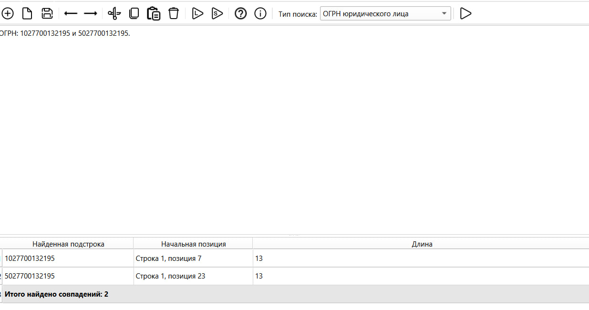
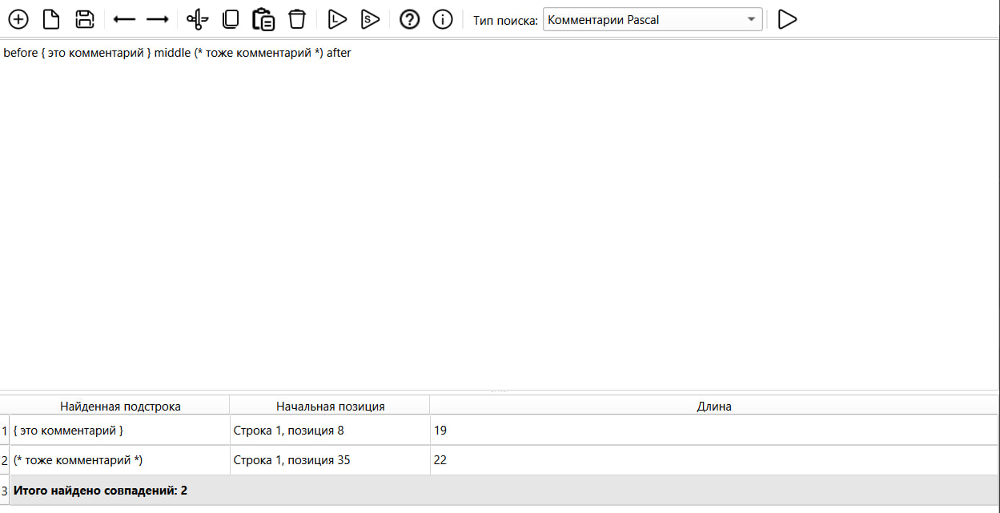
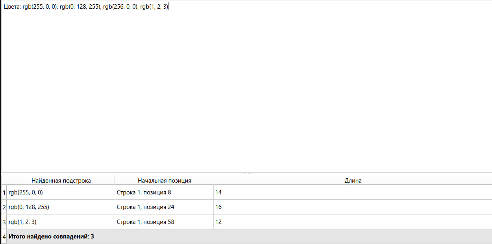
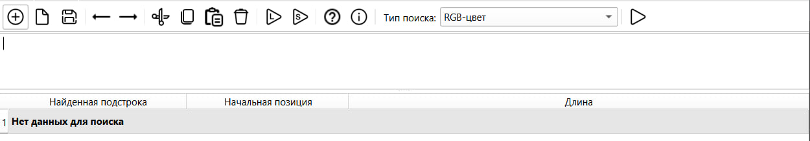
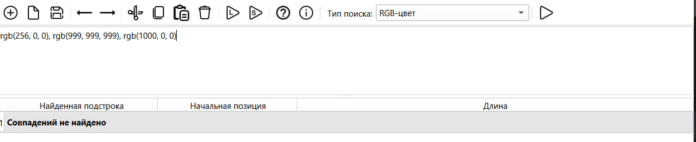

# Лабораторная работа №4 - Реализация алгоритма поиска подстрок с помощью регулярных выражений

## Цель работы
Изучить теоретические основы регулярных выражений и их применение для поиска и извлечения подстрок из текста. Освоить практические навыки использования библиотечных средств работы с регулярными выражениями, а также интеграцию алгоритмов поиска в графический интерфейс приложения.

## Автор
+ Башинов Арья Игоревич
+ Группа: АП-326

## Постановка задачи
Разработать модуль поиска подстрок с использованием регулярных выражений, интегрировать его в существующее приложение (текстовый редактор) и обеспечить наглядный вывод результатов.

Вариант задания содержит три задачи на поиск подстрок определённых форматов:
- ОГРН юридического лица.
- Комментарии на языке Pascal.
- Цветовой код RGB.

## Вариант задания

| № | Задача |
| --- | --- |
| 1 | ОГРН юридического лица |
| 2 | Комментарии на языке Pascal |
| 3 | Цветовой код RGB |

## Решение задач

### Задача 1. ОГРН юридического лица

**Описание.** ОГРН - основной государственный регистрационный номер. Для юридического лица содержит ровно 13 цифр. Первая цифра обозначает форму организации: 1 или 5 - для юридических лиц. Остальные 12 цифр - номер записи в реестре.

**Регулярное выражение:**
```python
r"\b[15]\d{12}\b"
```

**Пояснение каждого обозначения:**
- `\b` - граница слова: слева и справа от совпадения не должно быть букв, цифр или подчёркивания. Это предотвращает выделение ОГРН из середины длинного числа.
- `[15]` - один символ из набора: цифра 1 или цифра 5. Это первая цифра ОГРН юридического лица.
- `\d{12}` - ровно 12 цифр. `\d` означает любую цифру от 0 до 9, `{12}` - квантификатор, требующий ровно 12 повторений.
- `\b` - граница слова справа.

**Примеры строк, которые должны находиться:**
```
1027700132195
5027700132195
```

**Примеры строк, которые не должны находиться:**
```
3027700132195      (начинается с 3 - не форма юрлица)
102770013219       (12 цифр - мало)
10277001321955     (14 цифр - много)
```

**Результат работы программы:**



### Задача 2. Комментарии на языке Pascal

**Описание.** В языке Pascal комментарии бывают двух видов: в фигурных скобках `{ ... }` и в скобках со звёздочкой `(* ... *)`. Комментарии могут занимать несколько строк.

**Регулярное выражение:**
```python
r"\{[^}]*\}|\(\*.*?\*\)"
```

**Пояснение каждого обозначения:**
- `\{` - открывающая фигурная скобка. Экранирована, потому что в регулярных выражениях `{` является метасимволом квантификатора.
- `[^}]*` - ноль или более символов, кроме закрывающей фигурной скобки. Квадратные скобки с `^` в начале обозначают отрицание класса символов. `*` - квантификатор «ноль или более повторений». Это позволяет захватить всё содержимое комментария вплоть до `}`.
- `\}` - закрывающая фигурная скобка.
- `|` - оператор альтернативы («или»). Разделяет два варианта комментариев.
- `\(\*` - открывающая последовательность `(*`. Обе скобки экранированы.
- `.*?` - любое количество любых символов. `.` - любой символ, `*` - ноль или более повторений, `?` - нежадный квантификатор: захватывает минимально возможное количество символов до первой последовательности `*)`.
- `\*\)` - закрывающая последовательность `*)`.

**Примеры строк, которые должны находиться:**
```
{ это комментарий }
(* это тоже комментарий *)
{ многострочный
  комментарий }
```

**Примеры строк, которые не должны находиться:**
```
просто текст без комментариев
"строка с { } внутри"
```

**Результат работы программы:**



### Задача 3. Цветовой код RGB

**Описание.** Цветовой код RGB записывается в формате `rgb(R, G, B)`, где каждое число находится в диапазоне от 0 до 255. Числа разделяются запятыми, допускаются пробелы вокруг запятых.

**Регулярное выражение:**
```python
RGB_NUMBER = r"(25[0-5]|2[0-4]\d|1\d\d|\d\d?)"
PATTERN_RGB = r"rgb\(\s*" + RGB_NUMBER + r"\s*,\s*" + RGB_NUMBER + r"\s*,\s*" + RGB_NUMBER + r"\s*\)"
```

**Пояснение каждого обозначения:**
- `rgb\(` - литеральная последовательность `rgb(`, скобка экранирована.
- `\s*` - ноль или более пробельных символов.
- `(25[0-5]|2[0-4]\d|1\d\d|\d\d?)` - одно число от 0 до 255. Записано через четыре альтернативы:
  - `25[0-5]` - числа 250-255.
  - `2[0-4]\d` - числа 200-249.
  - `1\d\d` - числа 100-199.
  - `\d\d?` - числа 0-99 (одна или две цифры).
- `\s*,\s*` - запятая с необязательными пробелами вокруг.
- `\s*\)` - закрывающая круглая скобка с необязательными пробелами перед ней.

**Примеры строк, которые должны находиться:**
```
rgb(255, 0, 0)
rgb(0, 128, 255)
rgb(1, 2, 3)
```

**Примеры строк, которые не должны находиться:**
```
rgb(256, 0, 0)      (256 > 255)
rgb(999, 999, 999)  (все числа вне диапазона)
rgb(1000, 0, 0)     (1000 > 255)
```

**Результат работы программы:**



## Интерфейс программы

Функциональность интерфейса:
- ввод текста в область редактирования;
- выбор типа поиска через выпадающий список в панели инструментов;
- запуск поиска по клавише F7 или через меню «Пуск -> Поиск подстрок»;
- вывод найденных подстрок в таблицу из трёх колонок: найденная подстрока, начальная позиция, длина;
- отображение общего количества совпадений в итоговой строке и в строке состояния;
- переход к найденному фрагменту по щелчку на строке таблицы с выделением всего фрагмента в редакторе.

### Пустой ввод

Если текст в редакторе пуст или содержит только пробелы, выводится сообщение «Нет данных для поиска».



### Отсутствие совпадений

Если текст введён, но ни одна подстрока не соответствует выбранному шаблону, выводится сообщение «Совпадений не найдено». Это демонстрирует отсутствие ложных срабатываний.



## Используемые технологии
+ Язык программирования: Python 3.10+
+ GUI-фреймворк: PySide6 (Qt for Python)
+ Стандартный модуль `re` для работы с регулярными выражениями
+ Среда разработки: Visual Studio Code

## Инструкция по сборке и запуску
Клонировать репозиторий:
```powershell
git clone https://github.com/korposs/TFYAK_Lab4.git
cd TFYAK_Lab4
```

Установить зависимости:
```powershell
py -m pip install -r requirements.txt
```

Запустить приложение:
```powershell
py main.py
```

В средах, где Python запускается командой `python`, использовать её вместо `py`.

## Структура проекта
```text
TFYAK_Lab4/
├── main.py                       # точка входа приложения
├── text_editor.py                # главное окно и логика интерфейса
├── requirements.txt
├── README.md
├── .gitignore
├── compiler/
│   ├── __init__.py
│   ├── grammar.py                # константы грамматики
│   ├── scanner.py                # лексический анализатор (ЛР2)
│   ├── parser.py                 # синтаксический анализатор (ЛР3)
│   └── regex_search.py           # поиск подстрок по регулярным выражениям (ЛР4)
├── resources/
│   └── icons/                    # иконки панели инструментов
└── images/                       # иллюстрации для README
```

## Ограничения
+ Семантический анализ не реализован. Пункт «Семантический анализ» появится в лабораторной работе №5.
+ Пункты меню «Текст» открывают окна с краткими описаниями-заглушками.
+ Поддерживается работа с одним документом в одном окне.
+ Подсветка синтаксиса отсутствует.
+ Файлы читаются и сохраняются только в кодировке UTF-8.
+ Поиск подстрок работает только по трём предопределённым шаблонам: ОГРН, комментарии Pascal, RGB-цвет. Ввод произвольного регулярного выражения не предусмотрен.

## Вывод
В ходе лабораторной работы был успешно реализован модуль поиска подстрок с использованием регулярных выражений, который:
+ находит ОГРН юридического лица (13 цифр, первая цифра 1 или 5);
+ находит комментарии на языке Pascal в двух форматах: `{ ... }` и `(* ... *)`;
+ находит цветовые коды RGB с проверкой диапазона каждого числа от 0 до 255;
+ корректно обрабатывает многострочные комментарии;
+ не даёт ложных срабатываний на числах вне диапазона;
+ выводит результаты в таблицу с указанием позиции и длины каждой найденной подстроки;
+ подсвечивает найденный фрагмент в редакторе по щелчку на строке таблицы;
+ корректно работает с пустым вводом;
+ интегрирован в графический интерфейс, разработанный в лабораторной работе №1.